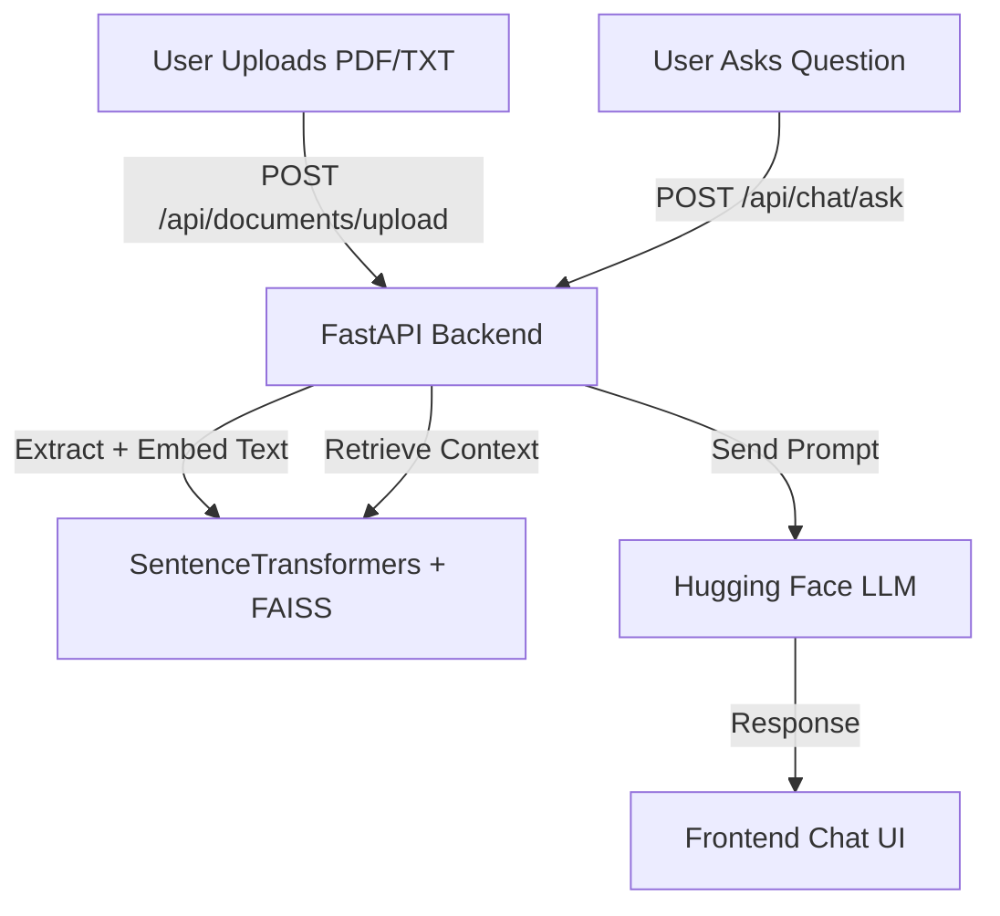

# 🧠 AI Knowledge Assistant


An AI-powered document assistant that lets you **upload files (PDF or TXT)** and **ask natural-language questions** about their content — powered by **FastAPI**, **Next.js 16**, **Tailwind 4.1**, and **local embeddings** for free, offline-friendly semantic search.

---

## 🚀 Features

✅ Upload and parse documents (`.pdf` or `.txt`)  
✅ Semantic chunk embedding and vector search (via `sentence-transformers`)  
✅ Context-aware AI responses using Hugging Face LLMs  
✅ Responsive, modern UI built with **Next.js 16 App Router** and **Tailwind 4.1**  
✅ 100 % free to host — deploy on **Render**, **Vercel**, or **Hugging Face Spaces**

---

## 🧱 Tech Stack

| Layer            | Technology                                | Purpose                     |
| :--------------- | :---------------------------------------- | :-------------------------- |
| **Frontend**     | Next.js 16.0.1 + Tailwind 4.1             | Modern web interface        |
| **Backend**      | FastAPI + Uvicorn                         | API and document processing |
| **AI/ML**        | SentenceTransformers + FAISS + Mistral-7B | Embeddings and generation   |
| **Language**     | Python 3.13                               | Backend development         |
| **Infra (Free)** | Render / Vercel                           | Hosting options             |

---

## 🧩 Architecture Overview



---

## ⚙️ Getting Started

### 🧠 Prerequisites

- Python 3.13.9 or newer
- Poetry 2.2.1 or newer
- Node.js 24.11.0 or newer
- npm 11.6.1 (or pnpm)
- _(Optional)_ Hugging Face token for faster inference

---

### 1️⃣ Clone the Repository

```bash
git clone https://github.com/yourusername/ai-knowledge-assistant.git
cd ai-knowledge-assistant
```

---

### 2️⃣ Backend Setup

```bash
cd backend
poetry install
poetry env activate
poertry run server
```

✅ Runs on → [http://localhost:8000](http://localhost:8000)

---

### 3️⃣ Frontend Setup

```bash
cd frontend
npm install
npm run dev
```

✅ Runs on → [http://localhost:3000](http://localhost:3000)

---

### 4️⃣ Usage

1. Upload a `.pdf` or `.txt` file
2. Wait for confirmation ("uploaded successfully")
3. Ask questions in plain English
4. Receive AI-generated answers based on the document content

---

## 📸 Screenshots

| Upload Page                              | Chat Interface                            |
| ---------------------------------------- | ----------------------------------------- |
|  |  |

_(Add screenshots after running the app locally.)_

---

## 🌐 Deployment

| Platform                | Description                                              |
| :---------------------- | :------------------------------------------------------- |
| **Vercel**              | Deploy frontend (Next.js) — free 1-click deployment      |
| **Render**              | Deploy backend (FastAPI) — free tier available           |
| **Hugging Face Spaces** | Host both frontend and backend using Gradio/Streamlit UI |

---

## 🧪 Example Query

> **User:** “Summarize the introduction.”  
> **Assistant:** “The introduction explains how machine learning models are trained on labeled datasets to predict outcomes for new data.”

---

## 📘 Folder Structure

```
ai-knowledge-assistant/
├── backend/              # FastAPI application
│   ├── app/              # Core code, routers, AI modules
│   └── requirements.txt
├── frontend/             # Next.js 16 + Tailwind 4 frontend
│   ├── app/              # App Router pages
│   └── components/       # Reusable UI components
└── README.md
```

---

## 🧠 What I Learned

- Building a full-stack AI app with **Next.js 16 App Router**
- Integrating **LLMs** into production FastAPI services
- Understanding **embeddings**, **semantic search**, and RAG architecture
- Designing for **performance**, **security**, and **UX**
- Deploying multi-service apps with free-tier cloud platforms

---

## 🧾 License

This project is licensed under the [MIT License](./LICENSE).

---

## 💬 Connect

If you found this project helpful:  
⭐ Star it on GitHub to support visibility!  
🧩 Fork it and add your own models or UI enhancements.  
📫 Reach out at [jason.amar2@gmail.com](mailto:jason.amar2@gmail.com)

---

**Made with ❤️ using FastAPI, Next.js 16, Tailwind 4, and open-source AI.**

---

## 📋 Project Roadmap

Below is the full development roadmap for the **AI Knowledge Assistant** project.
This outlines remaining tasks, planned improvements, and potential future features.

# ✅ Project To-Do List — AI Knowledge Assistant

This document outlines the remaining tasks and improvements to bring the **AI Knowledge Assistant** project to completion and make it production-ready.

---

## 🧱 Core Functionality

- [x] **FastAPI backend setup**
- [x] **Next.js 16 frontend integration**
- [x] **Tailwind 4.1 configuration**
- [x] **Document upload route (`/api/documents/upload`)**
- [x] **Chat question route (`/api/chat/ask`)**
- [x] **SentenceTransformer + FAISS embedding pipeline**
- [ ] Add **error handling and user feedback** for failed uploads or missing documents
- [ ] Improve **chunking and text splitting** (use paragraph-based or token-based segmentation)
- [ ] Add support for **multiple files** and session-based document memory

---

## 🤖 AI / LLM Integration

- [x] Implement **context-based Q&A pipeline**
- [ ] Switch to **local model fallback** (e.g., LLaMA, GPT4All, or Hugging Face small model)
- [ ] Integrate **OpenAI API (optional)** for better responses
- [ ] Add **configurable LLM provider** through environment variables
- [ ] Cache embeddings to improve performance on repeated queries

---

## 🎨 Frontend (Next.js 16 + Tailwind 4.1)

- [x] Setup base UI using **App Router**
- [x] Build **FileUploader** and **ChatUI** components
- [x] Style UI with **Tailwind 4.1 utilities**
- [ ] Add **loading states** and **skeleton UI**
- [ ] Include **error boundaries** and toast notifications
- [ ] Add **dark mode** toggle
- [ ] Store chat history in `localStorage`
- [ ] Add smooth scroll and transitions with **Framer Motion**

---

## ⚙️ Backend Improvements

- [ ] Move embedding + retrieval logic into a **separate class**
- [ ] Add **unit tests** for embeddings, search, and LLM responses
- [ ] Integrate **Redis** or **SQLite** for persistent storage
- [ ] Add **API versioning** (`/api/v1/`)
- [ ] Include **logging and monitoring** middleware
- [ ] Implement rate limiting and request validation

---

## 🌐 Deployment & DevOps

- [ ] Containerize app using **Docker Compose** (frontend + backend)
- [ ] Deploy backend to **Render / Railway / Fly.io**
- [ ] Deploy frontend to **Vercel**
- [ ] Setup **CORS and environment variables** correctly for production
- [ ] Add `.env.example` file for configuration
- [ ] Automate deployment with GitHub Actions

---

## 🧪 Testing

- [ ] Write integration tests for API endpoints
- [ ] Add frontend e2e tests (using **Playwright** or **Cypress**)
- [ ] Test on multiple browsers and devices
- [ ] Validate performance (loading time, LLM latency, memory usage)

---

## 🖼 Documentation & Presentation

- [x] Write detailed **README.md** with setup guide and architecture
- [ ] Create **demo video** or **animated GIFs**
- [ ] Add **screenshots** (upload + chat interface) in `/screenshots/`
- [ ] Write a **project overview article** on Medium / LinkedIn
- [ ] Add “What I Learned” section with reflections on the build process

---

## 💡 Future Enhancements

- [ ] Add **user authentication** (e.g., Clerk, Supabase Auth)
- [ ] Create a **multi-document dashboard**
- [ ] Integrate **voice input** and **text-to-speech responses**
- [ ] Enable **custom model fine-tuning** with user-provided datasets
- [ ] Build a **PWA (Progressive Web App)** version for mobile use
- [ ] Add analytics dashboard (usage stats, document summaries)

---

## 🧾 Final Steps Before Launch

- [ ] Add LICENSE and CONTRIBUTING.md files
- [ ] Double-check dependencies for production readiness
- [ ] Test deployment URLs end-to-end
- [ ] Update README with final links, screenshots, and demo video
- [ ] Announce the project on GitHub, Reddit, and LinkedIn 🚀

---

**Next Action:**  
🎯 Start by improving document chunking and integrating local model inference to reduce reliance on external APIs.
